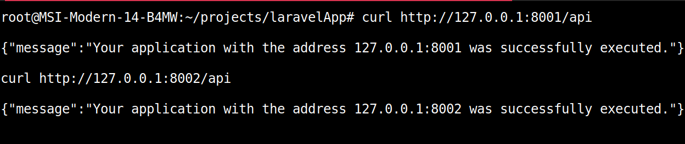

این سند مراحل پیکربندی یک برنامه Laravel به عنوان یک سرویس چند نمونه‌ای با استفاده از systemd را شرح می‌دهد. این روش به شما امکان می‌دهد چندین نمونه از API خود را با پیکربندی‌های مختلف در یک سرور واحد اجرا کنید.

### مرحله اول :‌ ایجاد اپلیکیشن لاراول و تعریف رست های مورد نظر

من یک رست مسیر ساده ایجاد میکنم تا آدرسی که برنامه با آن اجرا شده رو نشون بده 
	‍‍‍
`routes/api.php`

```
<?php

use Illuminate\Http\Request;
use Illuminate\Support\Facades\Route;

Route::get("/", function(Request $request) {
        return response()->json([
                "message" => "Your application with the address {$request->getHttpHost()} was successfully executed."
        ]);
});

```

### مرحله دوم: ایجاد Service Unit

`/etc/systemd/system/laravelapi@.service`

```
[Unit]
Description=Laravel Application Multi Instance Service
After=network.target'

[Service]
Type=simple
WorkingDirectory=/root/projects/laravelApp

ExecStart=/usr/bin/php artisan serve --port=%i
Restart=always
RestartSec=3

[Install]
WantedBy=multi.user.target

```

### مرحله سوم: بارگیری مجدد service ها - اجرا و فعال کردن سرویس

```
# بارگیر مجدد 
systemctl daemon-reload

# استارت سرویس با پورت 8001
systemctl start laravelapi@8001

# استارت سرویس با پورت 8002 
systemctl start laravelapi@8002

```


### مرحله چهارم: تست 😁


